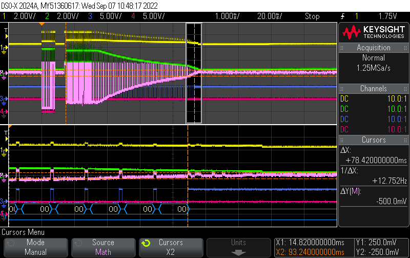

# Electricity meters reader
Python script for reading my EASTRON SDM120 / SDM72D-M RS-485 Modbus RTU electricity meters

## Pitfalls

### Weak power supply

SDM72D-M has weak power supply to sustain long communication:

* Yellow - RS485-A(+)
* Green - RS485-B(-)
* White - osc Math RS485-A - RS485-B
* Blue - PC dongle RX
* Red - PC dongle TX

After 33 transmitted bytes (from meter to PC), RS-485 voltage levels starts falling down.
I assume that internal power supply is too weak to source enought current for RS-485 transmitter.
It is able to transmitt approx. 73 bytes, until voltage is too low to my chinesse USB dongle, and only 70 bytes for [RS-485](https://en.wikipedia.org/wiki/RS-485#Signals) specification.
(Note that there are no 120 Ω terminators for now.)

**I do not know if this is only problem of internal communication module, or whole meter and what it does with meter accuracy!**
